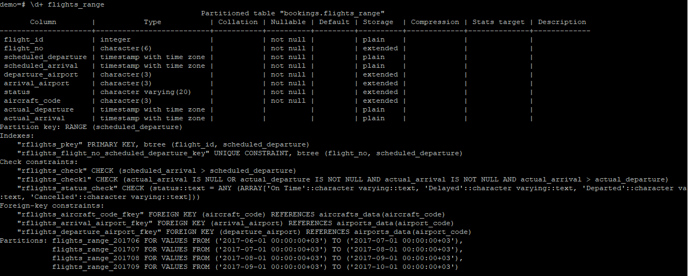

# Otus_homework_11
### СЕКЦИОНИРОВАНИЕ

* Скачаем БД DEMO и зальем ее:
psql -U postgres demo < /usr/download/demo-medium-20170815.sql

* Проверим необходимую нам таблицу flights:

* Т.к таблица уже создана мы не можем ее партиционировать. Создадим новую, с такими же ограничениями/индексами/констрейтами  
CREATE TABLE  

CREATE TABLE flights_range (  
  flight_id integer,  
	flight_no char(6) not null,  
	scheduled_departure timestamptz not null,  
	scheduled_arrival timestamptz not null,  
	departure_airport char(3) not null,  
	arrival_airport char(3) not null,  
	status character varying(20) not null,  
	aircraft_code  char(3) not null,  
	actual_departure timestamptz,  
	actual_arrival timestamptz,  
	CONSTRAINT rflights_pkey PRIMARY KEY(flight_id, scheduled_departure),  
	CONSTRAINT rflights_flight_no_scheduled_departure_key UNIQUE(flight_no, scheduled_departure),  
	CONSTRAINT rflights_check CHECK(scheduled_arrival > scheduled_departure),  
	CONSTRAINT rflights_check1 CHECK(actual_arrival IS NULL OR actual_departure IS NOT NULL AND actual_arrival IS NOT NULL AND actual_arrival > actual_departure), 
	CONSTRAINT rflights_status_check CHECK(status::text = ANY (ARRAY['On Time'::character varying::text, 'Delayed'::character varying::text,  
 'Departed'::character varying::text, 'Arrived'::character varying::text, 'Scheduled'::character varying::text,  
'Cancelled'::character varying::text])),  
	CONSTRAINT rflights_aircraft_code_fkey FOREIGN KEY (aircraft_code) REFERENCES aircrafts_data(aircraft_code),  
	CONSTRAINT rflights_arrival_airport_fkey FOREIGN KEY (arrival_airport) REFERENCES airports_data(airport_code),  
	CONSTRAINT rflights_departure_airport_fkey FOREIGN KEY (departure_airport) REFERENCES airports_data(airport_code))  
PARTITION BY RANGE(scheduled_departure);  

Еще создадим индекс:
CREATE INDEX sch_r ON flights_range (scheduled_departure);

* Создаем таблицы по таймзонам

CREATE TABLE flights_range_201706 PARTITION OF flights_range    
	FOR VALUES FROM ('2017-06-01'::timestamptz) TO ('2017-07-01'::timestamptz);  
CREATE TABLE flights_range_201707 PARTITION OF flights_range  
       FOR VALUES FROM ('2017-07-01'::timestamptz) TO ('2017-08-01'::timestamptz);  
CREATE TABLE flights_range_201709 PARTITION OF flights_range  
       FOR VALUES FROM ('2017-09-01'::timestamptz) TO ('2017-10-01'::timestamptz);  
CREATE TABLE flights_range_201708 PARTITION OF flights_range  
       FOR VALUES FROM ('2017-08-01'::timestamptz) TO ('2017-09-01'::timestamptz);  
CREATE TABLE flights_range_201707 PARTITION OF flights_range  
       FOR VALUES FROM ('2017-07-01'::timestamptz) TO ('2017-08-01'::timestamptz);  
CREATE TABLE flights_range_201706 PARTITION OF flights_range  
       FOR VALUES FROM ('2017-06-01'::timestamptz) TO ('2017-07-01'::timestamptz);  
CREATE TABLE flights_range_201705 PARTITION OF flights_range  
       FOR VALUES FROM ('2017-05-01'::timestamptz) TO ('2017-06-01'::timestamptz);  
       
Проверяем:

* Затем переносим данные из таблицы flights:
INSERT INTO flights_range SELECT * FROM flights;

* Проверяем что все успешно и поиск идет у нас по таблице с нужным рейнжем:
EXPLAIN ANALYZE select flight_id, flight_no, status from flights_range where scheduled_departure = '2017-05-28 09:50:00+03';

### НЕ СРАБАТЫВАЕТ СКАНИРОВАНИЕ ПО ИНДЕКСУ
EXPLAIN ANALYZE select flight_id, flight_no, status, scheduled_departure::date from flights_range where scheduled_departure::date = '2017-05-28*';  

